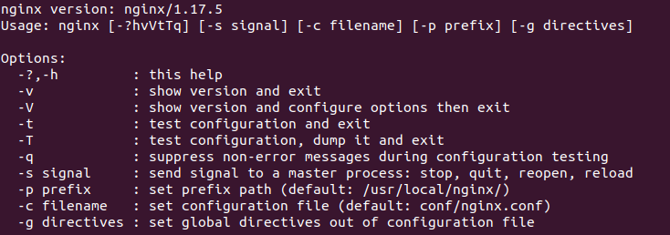

> 출처 : [Nginx HTTP Server(한국어판)](https://book.naver.com/bookdb/book_detail.nhn?bid=6740233), [Nginx HTTP Server 3rd edition](https://github.com/swn73/books/blob/master/Packt.Nginx.HTTP.Server.3rd.Edition.pdf)

## Nginx 등장 배경
>성능을 결정하는데 여러 요소가 있지만 크게 웹 서버, 웹 클라이언트, 통신망의 세 가지를 생각할 수 있다.  
웹 서버와 웹 클라이언트의 처리 속도가 아무리 빨라도 통신망의 속도가 느리면 웹 서버와 웹 클라이언트의 좋은 성능은 무용지물이 된다.  
따라서 웹의 역사 초기에는 통신망 성능 이슈에 초점이 맞춰져 있었다.  
하지만 이제는 웹 서버의 성능 이슈를 생각해야한다.  
_from 올긴이의 말_  

## Nginx의 장점
>1. 다른 경쟁 제품들보다 속도가 빠르다.  
엔진엑스는 비동기 소켓을 사용하는데, 요청을 받을 때마다 매번 프로세스를 만들지 않고, 코어당 하나의 프로세스만으로 수천 개의 접속을 충분히 처리하면서도 CPU 부하와 메모리 사용은 휠씬 적다.  
>2. 사용하기 쉽다.  
아파치 등의 웹 서버에 비해 환경 설정 파일을 매우 간단하게 읽고 수정할 수 있다.  
>3. 플러그인 시스템  
엔진엑스는 BSD 라이선스 기반의 오픈소스 프로젝트이며, '모듈'이라 불리는 플러그인 시스템이 있다.  
_from 들어가며_

## Nginx의 기본 HTTP 서버 기능
- 정적 파일, 인덱스 파일을 다루고 색인을 자동으로 처리
  - open file descriptor cache  
- 캐싱에 의한 리버스 프록싱 가속화
  - load balancing and fault tolerance  
- FastCGI와 uwsgi와 SCGI와 mamcached servers의 캐싱에 의한 지원 가속화  
  - load balancing and fault tolerance  
- 모듈화된 구조  
  - 필터는 gzipping, 바이트 범위, 청크 응답, XSLT, SSI, 이미지 크기 조정 필터를 포함한다.
  - 프록시 서버나 FastCGI/uwsgi/SCGI 서버를 사용한다면 단일 페이지 안에 포함된 다수의 SSI를 병렬로 처리할 수 있다.  
- SSL과 TLS SNI를 지원한다.
- 가중 및 의존성 기반으로 우선순위를 매겨 HTTP/2를 지원한다.  

이외 HTTP 서버 기능, 메일 프록시 서버 기능, TCP/UDP 프록시 서버 기능 등은 [여기](http://nginx.org/en/)를 참고.

## Nginx 다운로드 및 설치
- 선행 요소 설치  
  - __GCC__  
  엔진엑스는 C로 작성되어 있기에 C언어 컴파일 도구를 설치해야한다.
  - __pcre__, __pcre-devel__  
  엔진엑스를 컴파일하는데 펄 호환 정규식이 필요하다.  
  엔진엑스 재작성 모듈과 HTTP 코어 모듈은 PCRE 구문에 따르는 정규표현식을 사용한다.
  pcre는 컴파일된 버전의 라이브러리를 제공하고  
  pcre-devel은 프로젝트를 컴파일하기 위한 개발용 헤더와 소스코드를 제공한다.
  - __zlib__, __zlib-devel__  
  zlib은 압축 알고리즘을 제공한다. 엔진엑스 모듈에서 gzip 압축을 사용하려면 zlib 라이브러리가 필요하다.
  - __openssl__, __openssl-del__   
  OpenSSL 프로젝트는 고성능 범용 암호 해독 라이브러리, SSL v2/v3, TLS v1을 구현하여 상용 제품 수준의 오픈소스 툴킷을 개발한다. (SSL v2/v3은 보안 결함으로 더이상 사용하지 않습니다. [참고링크](https://wiki.openssl.org/index.php/SSL_and_TLS_Protocols))  
  엔진엑스는 OpenSSL 라이브러리를 이용해 보안 웹페이지를 서비스하기 때문에 openssl를 설치해야한다.  


- Nginx 다운로드
  - Nginx는 mainline, stable, legacy의 세 가지 버전이 있다. [다운로드 페이지](http://nginx.org/en/download.html)  

      
  출처 : <https://www.nginx.com/blog/nginx-1-6-1-7-released/>  

    mainline은 최신 버전이고, stable은 안정된 버전이다. 위 그림에서 볼 수 있듯이 mainline과 stable의 차이는 최신 기능의 추가 여부다. stable에서 결함이 발견되면 mainline을 수정하고 stable에 적용하기 때문에 mainline과 stable의 안전성은 거의 동일하다고 본다. legacy는 오래된 버전이다.  
    서비스 구성 환경에 따라 서버 개발자가 적합한 버전을 선택하면 된다.  

    ```
    $ wget http://nginx.org/download/nginx-1.17.5.tar.gz  
    $ tar zxf nginx-1.17.5.tar.gz
    ```  
- Nginx 설치  
  `./configure` `make` `make install` 세 가지 명령어로 컴파일하고 설치할 수 있다.  

  - 환경 설정  
  `./configure` 명령어 뒤에 옵션을 추가하여 환경 설정이 가능하다.

    `--prefix=` : 모든 환경 설정 지시어들의 기반 경로를 설정  
    `--conf-path=` : 환경 설정 파일의 경로  
    `--user=` : Nginx worker process를 실행하기 위한 기본 사용자 계정  
    `--group=` : Nginx worker process를 실행하기 위한 기본 사용자 그룹  
    `--with-http_ssl_module` : HTTPS 콘텐츠를 서비스할 수 있게 해주는 모듈 추가  
    `--with-http-realip-module` : Nginx를 백엔드 서비스로 사용할 때 방문자 IP 주소를 추출할 수 있게 해주는 모듈 추가  
    `--without-http` : HTTP 서비스 기능 제거

    이외 사용가능한 옵션들은  
    ```
    $ ./configure --help
    ```
    로 확인하거나 [여기](http://nginx.org/en/docs/configure.html)를 참고.

    - `./configure` 사용의 예  
    ```
    $ ./configure --user=www-data \
    --group=www-data \
    --with-http_ssl_module \
    --with-http_realip_module
    ```  
  - 컴파일  
  ```
  $ make
  ```  
  - 설치
  ```
  $ make install  
  ```  

  Nginx 구성 파일  
    

## Nginx 서비스 제어
- 데몬과 서비스  
  엔진엑스는 백그라운드 서비스이며 데몬이라고 부른다. httpd, named와 같이 보통 데몬의 이름에는 끝에 d가 붙는데 엔진엑스에는 붙지 않는다.  

- 사용자와 그룹  
  엔진엑스에는 두 종류의 프로세스 레벨이 있다.
  1. 엔진엑스 마스터 프로세스  
  루트 계정으로 실행하면 시스템의 모든 포트에 TCP 소켓을 오픈할 수 있지만, 다른 사용자로 실행하면 1024 이상의 포트에서만 소켓을 listen할 수 있다. 그리고 80이나 443 같은 표준 포트에 접근할 수 없고, 작업자 프로세스에 사용자와 그룹을 부여하는 user 지시어도 수행할 수 없다.  

  2. 엔진엑스 작업자 프로세스  
  환경 설정 파일에서 user 지시어로 지정한 계정으로 실행된다. 컴파일할 때 입력하는 환경 설정 옵션보다 환경 설정 파일에서 설정한 것이 우선한다. 아무 계정도 지정하지 않으면 작업자 프로세스는 nobody 사용자와 nobody 그룹으로 실행된다(OS에 따라 다름).  

  3. 엔진엑스 커맨드라인 스위치
  ```
  $ cd /usr/local/nginx/sbin  
  $ ./nginx -h  
  ```  
  결과화면  
    
